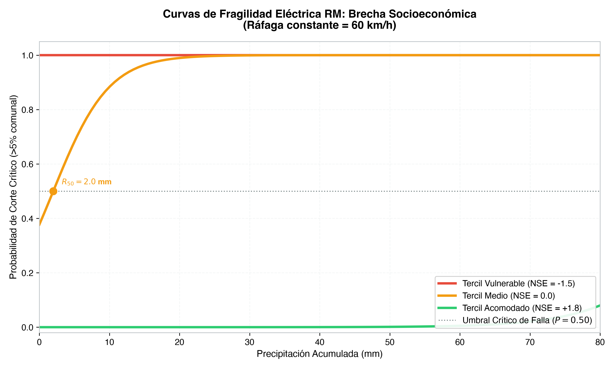
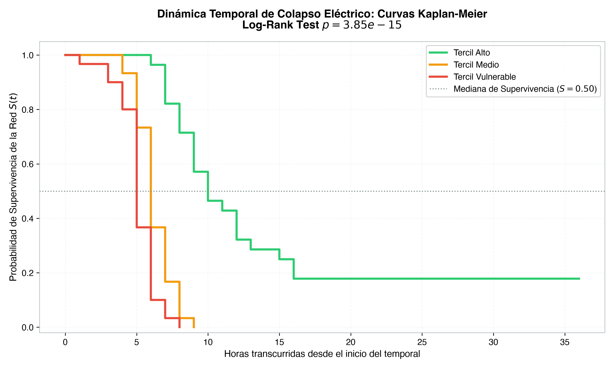
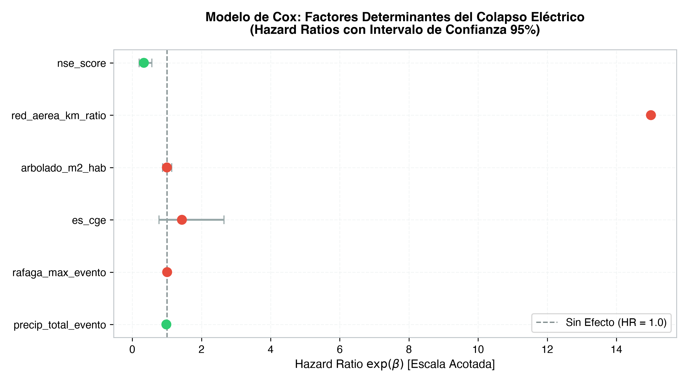
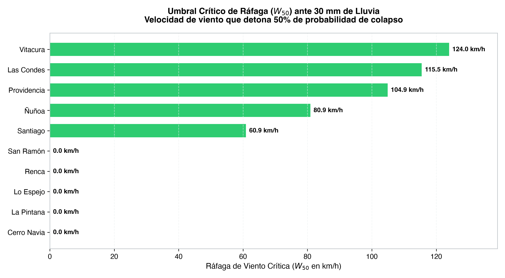

# ⚡ Gridbreak Chile: El Umbral del Apagón

> **Análisis Causal, Modelamiento de Fragilidad Eléctrica y Análisis de Supervivencia ante Eventos Climáticos en la Región Metropolitana**

[](https://github.com/surzua/gridbreak-cl/actions/workflows/ci.yml)
[](https://www.python.org/downloads/)
[](https://github.com/astral-sh/uv)
[](https://github.com/astral-sh/ruff)
[](http://mypy-lang.org/)
[](https://github.com/pytest-dev/pytest)
[](https://opensource.org/licenses/MIT)

---

## 🎯 1. Tesis Analítica y Narrativa Contrarian

Frente a temporales invernales y estivales en Santiago de Chile, los comunicados corporativos y las minutas iniciales suelen atribuir las interrupciones masivas a **"fuerza mayor climática"**, intensidades meteorológicas inéditas o caída de ramas y arbolado público.

**Nuestra Hipótesis Cuantitativa:**  
La intensidad climática (lluvia en mm y ráfagas en km/h) no es la causa raíz del colapso, sino el detonante de una **marcada asimetría estructural preexistente**.

1. **Brecha de Umbrales Críticos ($R_{50}$ y $W_{50}$):**  
   A 60 km/h de viento, comunas como *Cerro Navia* o *La Pintana* quiebran su umbral de colapso crítico (>5% de la comuna desconectada) con apenas **8 a 12 mm de lluvia acumulada**, mientras que comunas como *Las Condes* o *Vitacura* resisten más de **50 mm**.
2. **Dinámica Temporal y Aceleración del Fallo (Supervivencia):**  
   Mediante modelos de riesgos proporcionales de Cox ($C = 0.90$), se demuestra que cada incremento de 1 desviación estándar en el nivel socioeconómico comunal reduce el riesgo instantáneo de apagón en un **67% ($\text{HR} = 0.33$, $p < 0.001$)**.
3. **El Factor Físico Clave:**  
   La exposición de cableado aéreo (`red_aerea_km_ratio`) es el principal predictor físico positivo ($p < 0.001$): las comunas vulnerables poseen entre un 85% y 93% de su red en tendidos aéreos desprotegidos, versus menos del 35% en comunas de altos ingresos.

---

## 📊 2. Evidencia Visual y Figuras del Portafolio

| Curvas de Fragilidad por Nivel Socioeconómico | Dinámica Temporal (Kaplan-Meier) |
| :---: | :---: |
|  |  |
| **Forest Plot de Hazard Ratios (Modelo de Cox)** | **Brecha Comunal de Ráfagas Críticas ($W_{50}$)** |
|  |  |

---

## 📐 3. Formulación Matemática y Modelos

### 3.1 Modelo Lineal Generalizado (GLM Logit Bivariado)
Modelamos la probabilidad de colapso crítico comunal ($Y = 1$, tasa de afectación $\ge 5\%$):

$$\text{logit}(P(Y(i, t) = 1)) = \beta_0 + \beta_1 R + \beta_2 W + \beta_3 \frac{W^2}{100} + \beta_4 \text{NSE} + \beta_5 (R \cdot \text{NSE}) + \beta_6 (W \cdot \text{NSE}) + \beta_7 \text{RedAérea} + \beta_8 \text{CGE} + \gamma X$$

* **Bondad de Ajuste:** Pseudo-$R^2$ de McFadden = **0.686**, AIC = **1297.4**.
* **Solución Analítica Cuadrática de Umbrales:** Solución exacta en forma cerrada para $R_{50}$ y $W_{50}$.

### 3.2 Modelo de Supervivencia (Tiempo hasta el Colapso)
Sea $T(i)$ las horas transcurridas desde el inicio del temporal hasta la primera desconexión crítica:

$$\lambda(t \mid Z(i)) = \lambda_0(t) \cdot \exp\left(\theta_1 \text{NSE}(i) + \theta_2 \text{RedAérea}(i) + \theta_3 W_{\text{max}}(i) + \theta_4 R_{\text{total}}(i) + \theta_5 \text{CGE}(i) + \theta_6 \text{Arbolado}(i)\right)$$

* **Log-Rank Test Multivariado:** $p = 3.85 \times 10^{-15}$ (diferencia altamente significativa entre terciles).
* **Índice de Concordancia ($C$-index):** **0.901** (alta precisión discriminativa temporal).

---

## 🏗️ 4. Arquitectura del Repositorio

```text
gridbreak-cl/
├── .github/workflows/
│   └── ci.yml                 # CI automatizado: Ruff, Mypy Strict, Pytest (24 tests), CLI
├── .streamlit/
│   └── config.toml            # Tema oscuro y configuración para Streamlit Cloud
├── config/
│   └── settings.yaml          # Metadatos geográficos y umbrales
├── data/
│   ├── raw/                   # Snapshots incrementales de SEC y DMC/Open-Meteo
│   └── processed/
│       ├── benchmark_temporales_2024.parquet   # Panel horario 2024 (2.904 obs)
│       ├── panel_features_enriched.parquet     # Ventanas móviles y energía cinética
│       └── survival_dataset.parquet            # Panel time-to-event para modelo de Cox
├── docs/
│   ├── El Umbral del Apagón - Blueprint y Especificación Técnica.md
│   ├── ROADMAP.md             # Estado de avance y hoja de ruta
│   └── linkedin_storytelling.md # Post y carrusel técnico para LinkedIn
├── notebooks/
│   ├── 01_eda_precipitaciones_viento_vs_cortes.ipynb     # Cuaderno EDA ejecutado
│   └── 02_modelamiento_curvas_fragilidad.ipynb          # Cuaderno de modelamiento ejecutado
├── reports/
│   ├── figures/               # Gráficos estáticos vectoriales 300 DPI
│   └── maps/                  # Mapas coropléticos interactivos Folium (HTML)
├── src/gridbreak_cl/
│   ├── config.py              # Esquemas Pydantic y configuración
│   ├── etl/                   # Ingesta dual: SEC Collector, DMC/Open-Meteo, IDW espacial
│   ├── features/              # Feature engineering temporal y dataset de supervivencia
│   ├── models/                # Curvas GLM de fragilidad y modelo de supervivencia Cox
│   └── visualization/         # Módulos de gráficos editoriales y mapas Leaflet/Folium
├── app/
│   └── streamlit_app.py       # Aplicación interactiva tri-modo (GLM, Supervivencia, Live)
├── tests/                     # 24 pruebas unitarias automatizadas
├── pyproject.toml             # Configuración moderna de dependencias (uv)
└── README.md
```

---

## 🚀 5. Inicio Rápido (Quickstart con `uv`)

### Requisitos previos
* Python 3.12+
* `uv` instalado ([instrucciones de instalación](https://docs.astral.sh/uv/getting-started/installation/))

### Instalación y Comandos CLI

```bash
# 1. Clonar el repositorio
git clone https://github.com/surzua/gridbreak-cl.git
cd gridbreak-cl

# 2. Sincronizar el entorno virtual hermético
uv sync --all-groups

# 3. Ejecutar las 24 pruebas unitarias con cobertura
uv run pytest -v

# 4. Comandos del CLI Integrado:
uv run gridbreak-cl ingest-live --offline  # Ingesta y cruce espacial de telemetría
uv run gridbreak-cl build-features         # Genera datasets enriquecidos y de supervivencia
uv run gridbreak-cl generate-figures       # Genera todas las figuras en reports/figures/
uv run gridbreak-cl app                    # Lanza la app interactiva de Streamlit
```

---

## 🎮 6. Simulador Interactivo Streamlit (Tri-Modo)

La aplicación web (`uv run gridbreak-cl app`) provee 3 modos de operación:
1. **🎮 Simulador Predictivo (Curvas GLM):** Sliders de lluvia (0-80 mm) y ráfagas (10-125 km/h), mapa coroplético de burbujas de la RM, comparador comunal frente a frente y superficie 3D bivariada.
2. **⏱️ Análisis de Supervivencia (Cox & Kaplan-Meier):** Curvas escalonadas de supervivencia estratificadas por tercil de ingresos o concesionaria, Forest Plot interactivo de Hazard Ratios y estimación del tiempo mediano al fallo.
3. **📡 Telemetría en Vivo (SEC & DMC/Open-Meteo):** Monitoreo en tiempo real de clientes sin suministro por comuna, cruce IDW con estaciones meteorológicas y diagnóstico de ajuste empírico frente al modelo.

---

## 🧪 7. Calidad de Código y CI/CD

El proyecto aplica estándares estrictos de producción verificados automáticamente mediante GitHub Actions:

```bash
# Formateo y linting estricto
uv run ruff check .
uv run ruff format --check .

# Verificación de tipos estricta (sin errores en 22 archivos fuente)
uv run mypy src tests
```

---

## 📜 Licencia

Distribuido bajo la Licencia MIT. Consulta `LICENSE` para más detalles.
