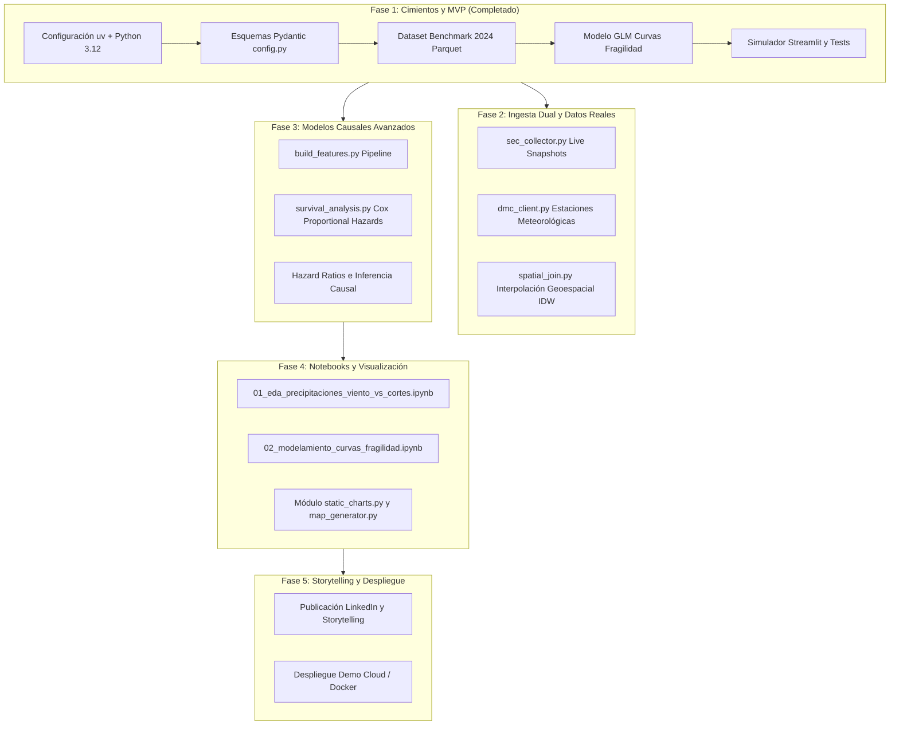

# 🗺️ Roadmap de Proyecto: Gridbreak Chile

> **Guía paso a paso del desarrollo, hitos de ingeniería y estado de avance**  
> Proyecto: *El Umbral del Apagón — Modelamiento de Fragilidad Eléctrica ante Eventos Climáticos en la RM*

---

## 📊 Resumen Ejecutivo del Estado del Proyecto

| Fase | Descripción | Estado | Cobertura / Entregables |
| :--- | :--- | :---: | :--- |
| **Fase 1** | **Cimientos, Modelo Base y MVP Funcional** | `100% COMPLETADO` ✅ | uv stack, config Pydantic, seed benchmark 2024, GLM logit, Streamlit app, tests pytest. |
| **Fase 2** | **Ingesta Dual y Telemetría en Vivo** | `PENDIENTE` ⏳ | Live collector SEC (`sec_collector.py`), cliente DMC (`dmc_client.py`), spatial join IDW. |
| **Fase 3** | **Modelamiento Causal Avanzado (Supervivencia)** | `PENDIENTE` ⏳ | Modelo Cox Proportional Hazards (`survival_analysis.py`), Hazard Ratios tiempo al colapso. |
| **Fase 4** | **Jupyter Notebooks de Evidencia y Visualización** | `PENDIENTE` ⏳ | Notebooks de EDA y modelamiento, gráficos estáticos listos para publicación técnica. |
| **Fase 5** | **Storytelling de Alto Impacto y Despliegue** | `PENDIENTE` ⏳ | Estrategia LinkedIn, exportación de assets visuales, despliegue en la nube (Streamlit Cloud). |

---

## 🧗 Paso a Paso Detallado por Fases

---

### 🟢 Fase 1: Cimientos, Modelo Base y MVP Funcional *(Completado y Refinado)*
- [x] **Gestión de dependencias moderna:** Inicialización con `uv`, lockfile reproducible y tipado `mypy` estricto (`--strict`).
- [x] **Esquemas de validación de datos:** Modelos Pydantic (`SECCutRecord`, `WeatherRecord`, `ComunaFeatures` con `red_aerea_km_ratio` y `es_rural`) en `src/gridbreak_cl/config.py`.
- [x] **Motor de Replay / Benchmark 2024:** Generación del dataset sintético-calibrado de 52 comunas con 120 horas de panel de los temporales de Junio y Agosto 2024 en `data/processed/benchmark_temporales_2024.parquet`.
- [x] **Modelo GLM de Fragilidad Refinado:**
  - Control explícito por exposición de cableado aéreo (`red_aerea_km_ratio`) para evitar sesgo de variable omitida.
  - No linealidad aerodinámica de fuerza de arrastre ($W^2 / 100$).
  - Términos de interacción cruzada estadísticamente significativos ($\text{Lluvia} \times \text{NSE}$ y $\text{Viento} \times \text{NSE}$).
  - Solución analítica exacta de umbrales críticos de lluvia ($R_{50}$) y viento ($W_{50}$ vía fórmula cuadrática) en `src/gridbreak_cl/models/fragility_curves.py`.
- [x] **Simulador interactivo en Streamlit con Diagnóstico Científico:**
  - Sliders meteorológicos, presets históricos, mapa coroplético de burbujas de la RM con Plotly, comparador comunal frente a frente con ratio de red aérea y superficie 3D bivariada en `app/streamlit_app.py`.
  - Pestaña expandible de **Evidencia Econométrica y Diagnóstico**: Pseudo-$R^2$ de McFadden (0.686), AIC, tabla de coeficientes con significancia ($*** p < 0.001$) y exportación del escenario en CSV.
- [x] **Suite de pruebas unitarias robusta:**
  - Cobertura de esquemas, generación de datos, coherencia de gap de vulnerabilidad, solución analítica cuadrática de umbrales y prueba de ajuste sobre el Parquet real en `tests/test_etl.py` y `tests/test_models.py` (7 tests pasando).

---

### 🟡 Fase 2: Ingesta Dual y Telemetría en Vivo *(Próximo Hito)*
*Objetivo: Permitir que el sistema no solo funcione con el benchmark histórico, sino que capture y procese datos reales durante eventos climáticos activos.*

- [ ] **2.1 Live SEC Collector (`src/gridbreak_cl/etl/sec_collector.py`):**
  - Scraping / consumo del endpoint público de interrupciones de la SEC.
  - Persistencia incremental de snapshots horarios en `data/raw/sec/`.
  - Manejo de reintentos con backoff exponencial.
- [ ] **2.2 DMC Weather Client (`src/gridbreak_cl/etl/dmc_client.py`):**
  - Ingesta de datos de estaciones de referencia de la DMC (Quinta Normal, Tobalaba, Pudahuel, etc.).
  - Parsing de variables: precipitación horaria, viento sostenido y ráfaga máxima.
- [ ] **2.3 Cruce Geoespacial (`src/gridbreak_cl/etl/spatial_join.py`):**
  - Interpolación espacial inversa a la distancia (IDW) o asignación por polígonos de Voronoi para asignar métricas climáticas a centroides comunales usando `GeoPandas` y `Shapely`.

---

### 🟡 Fase 3: Feature Engineering y Modelo de Supervivencia *(Próximo Hito)*
*Objetivo: Estimar no solo la probabilidad estática de falla, sino la dinámica temporal de cuánto resiste una comuna antes de colapsar.*

- [ ] **3.1 Pipeline de Features (`src/gridbreak_cl/features/build_features.py`):**
  - Métricas acumuladas en ventanas móviles (lluvia en 6h, 12h, 24h).
  - Cálculo de ratios de red aérea vs. soterrada y densidad de clientes por km de línea.
- [ ] **3.2 Modelo de Riesgos Proporcionales de Cox (`src/gridbreak_cl/models/survival_analysis.py`):**
  - Formulación de $T(i)$ como tiempo transcurrido desde el inicio de la lluvia hasta $Y=1$ ($\ge 5\%$ corte).
  - Ajuste de modelo semi-paramétrico con `lifelines`.
  - Cuantificación de Hazard Ratios (HR) para nivel socioeconómico (demostrando aumento de riesgo relativo en comunas vulnerables).
- [ ] **3.3 Pruebas de Supervivencia (`tests/test_survival.py`):**
  - Validación de supuestos de proporcionalidad y convergencia numérica.

---

### ⚪ Fase 4: Cuadernos de Evidencia (Jupyter Notebooks) y Gráficos Estáticos
*Objetivo: Documentar paso a paso la investigación para revisión técnica y generación de figuras de alta resolución.*

- [ ] **4.1 `notebooks/01_eda_precipitaciones_viento_vs_cortes.ipynb`:**
  - Análisis exploratorio de datos de los temporales 2024.
  - Correlaciones bivariadas, dispersión de ráfagas vs. número de clientes sin luz.
- [ ] **4.2 `notebooks/02_modelamiento_curvas_fragilidad.ipynb`:**
  - Diagnóstico de coeficientes GLM ($p$-values, pseudo-$R^2$, bondad de ajuste).
  - Curvas sigmoides comparativas por terciles de ingreso (Vulnerable vs. Medio vs. Alto).
- [ ] **4.3 Módulo de Visualizaciones Publicables (`src/gridbreak_cl/visualization/`):**
  - Generación de gráficos estáticos vectoriales / PNG listos para presentaciones y redes sociales.

---

### ⚪ Fase 5: Storytelling, Divulgación y Portafolio Senior
*Objetivo: Maximizar el impacto del proyecto en GitHub y plataformas profesionales.*

- [ ] **5.1 Narrativa y Post de LinkedIn:**
  - Estructuración del post: gancho contrarian ("*¿Fuerza mayor o asimetría estructural?*"), hallazgos clave, gráficos de impacto y llamada a la acción.
- [ ] **5.2 CI/CD con GitHub Actions:**
  - Workflow automatizado de validación: `ruff check`, `mypy --strict`, `pytest --cov`.
- [ ] **5.3 Despliegue Público de la App:**
  - Configuración para despliegue en Streamlit Community Cloud con datos benchmark pre-cargados.
