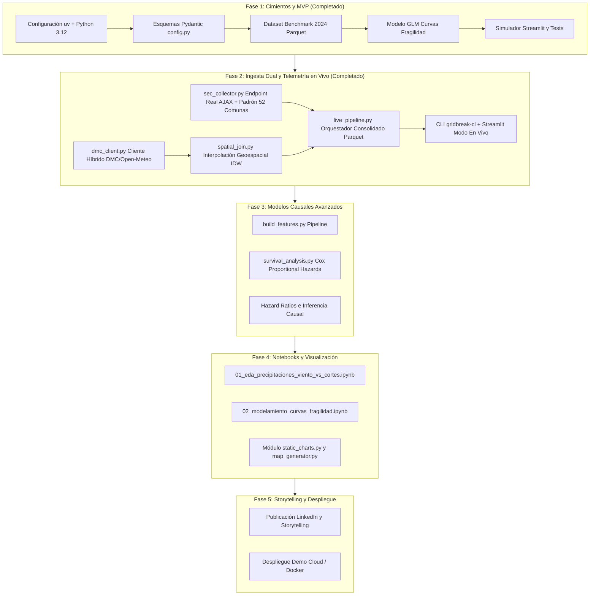

# 🗺️ Roadmap de Proyecto: Gridbreak Chile

> **Guía paso a paso del desarrollo, hitos de ingeniería y estado de avance**  
> Proyecto: *El Umbral del Apagón — Modelamiento de Fragilidad Eléctrica ante Eventos Climáticos en la RM*

---

## 📊 Resumen Ejecutivo del Estado del Proyecto

| Fase | Descripción | Estado | Cobertura / Entregables |
| :--- | :--- | :--- | :--- |
| **Fase 1** | **Cimientos, Modelo Base y MVP Funcional** | `100% COMPLETADO` ✅ | uv stack, config Pydantic, seed benchmark 2024, GLM logit, Streamlit app, tests pytest. |
| **Fase 2** | **Ingesta Dual y Telemetría en Vivo** | `100% COMPLETADO` ✅ | Live SEC Collector (`sec_collector.py`), DMC & Open-Meteo Client (`dmc_client.py`), IDW Spatial Join (`spatial_join.py`), Orquestador (`live_pipeline.py`), CLI `gridbreak-cl ingest-live`, Streamlit dual mode, 13 tests. |
| **Fase 3** | **Modelamiento Causal Avanzado (Supervivencia)** | `100% COMPLETADO` ✅ | Feature pipeline (`build_features.py`), Kaplan-Meier estratificado, Log-Rank test ($p < 0.001$), Cox PH con penalización L2 (`survival_analysis.py`), Hazard Ratios, Concordance $C=0.90$, Streamlit modo supervivencia y 20 tests unitarios. |
| **Fase 4** | **Jupyter Notebooks de Evidencia y Visualización** | `100% COMPLETADO` ✅ | Notebooks ejecutados (`01_eda`, `02_modelamiento`), figuras 300 DPI (`reports/figures/`), mapas interactivos Folium (`reports/maps/`), módulos `static_charts.py` y `map_generator.py`, 24 tests. |
| **Fase 5** | **Storytelling de Alto Impacto y Despliegue** | `PENDIENTE` ⏳ | Estrategia LinkedIn, exportación de assets visuales, despliegue en la nube (Streamlit Cloud). |

---

## 🧗 Paso a Paso Detallado por Fases

---

### 🟢 Fase 1: Cimientos, Modelo Base y MVP Funcional *(Completado y Refinado)*
- [x] **Gestión de dependencias moderna:** Inicialización con `uv`, lockfile reproducible y tipado `mypy` estricto (`--strict`).
- [x] **Esquemas de validación de datos:** Modelos Pydantic (`SECCutRecord`, `WeatherRecord`, `ComunaFeatures` con `red_aerea_km_ratio` y `es_rural`) en `src/gridbreak_cl/config.py`.
- [x] **Motor de Replay / Benchmark 2024:** Generación del dataset sintético-calibrado de 52 comunas con 120 horas de panel de los temporales de Junio y Agosto 2024 en `data/processed/benchmark_temporales_2024.parquet`.
- [x] **Modelo GLM de Fragilidad Refinado:**
  - Control explícito por exposición de cableado aéreo (`red_aerea_km_ratio`) para evitar sesgo de variable omitida.
  - No linealidad aerodinámica de fuerza de arrastre ($W^2 / 100$).
  - Términos de interacción cruzada estadísticamente significativos ($\text{Lluvia} \times \text{NSE}$ y $\text{Viento} \times \text{NSE}$).
  - Solución analítica exacta de umbrales críticos de lluvia ($R_{50}$) y viento ($W_{50}$ vía fórmula cuadrática) en `src/gridbreak_cl/models/fragility_curves.py`.
- [x] **Simulador interactivo en Streamlit con Diagnóstico Científico:**
  - Sliders meteorológicos, presets históricos, mapa coroplético de burbujas de la RM con Plotly, comparador comunal frente a frente con ratio de red aérea y superficie 3D bivariada en `app/streamlit_app.py`.
  - Pestaña expandible de **Evidencia Econométrica y Diagnóstico**: Pseudo-$R^2$ de McFadden (0.686), AIC, tabla de coeficientes con significancia ($*** p < 0.001$) y exportación del escenario en CSV.
- [x] **Suite de pruebas unitarias robusta:**
  - Cobertura de esquemas, generación de datos, coherencia de gap de vulnerabilidad, solución analítica cuadrática de umbrales y prueba de ajuste sobre el Parquet real en `tests/test_etl.py` y `tests/test_models.py` (7 tests pasando).

---

### 🟢 Fase 2: Ingesta Dual y Telemetría en Vivo *(Completado y Operativo)*
*Objetivo: Permitir que el sistema capture y procese datos reales durante eventos climáticos activos o consulte telemetría en tiempo real de la RM.*

- [x] **2.1 Live SEC Collector (`src/gridbreak_cl/etl/sec_collector.py`):**
  - Consumo directo de la API AJAX real en producción de la SEC (`apps.sec.cl/INTONLINEv1/ClientesAfectados/GetPorFecha`).
  - Normalización canónica de nombres de comunas y diccionario fonético-ortográfico de las 52 comunas de la RM.
  - Cruce automático con el padrón base regulado de clientes totales y empresa concesionaria (`ENEL` / `CGE`).
  - Persistencia incremental de snapshots horarios en `data/raw/sec/` con política de reintentos y backoff exponencial.
  - Validación estricta con Pydantic (`SECCutRecord`).
- [x] **2.2 DMC Weather Client (`src/gridbreak_cl/etl/dmc_client.py`):**
  - Cliente meteorológico híbrido: soporte para API oficial de la DMC (con token) y fallback automático a Open-Meteo (API pública sin token) para las 5 estaciones de referencia de la RM (Quinta Normal, Tobalaba, Pudahuel, La Florida, Talagante).
  - Telemetría horaria: precipitación acumulada (`precipitacion_mm`), velocidad sostenida (`viento_kmh`) y ráfaga máxima (`rafaga_max_kmh`).
  - Persistencia incremental en `data/raw/weather/` y modo offline fixture para CI/CD.
  - Validación con Pydantic (`WeatherRecord`).
- [x] **2.3 Cruce Geoespacial IDW (`src/gridbreak_cl/etl/spatial_join.py`):**
  - Ponderación espacial inversa a la distancia (IDW) con potencia calibrada ($p=2.0$) y distancia de Haversine geodésica.
  - Asignación sobre centroides de cabeceras urbanas/poblacionales de las 52 comunas de la RM.
  - Asignación de estación de referencia más cercana (Voronoi nearest) y distancia métrica en kilómetros.
- [x] **2.4 Pipeline Orquestador (`src/gridbreak_cl/etl/live_pipeline.py`):**
  - Ejecución sincronizada y alineación temporal con `ZoneInfo("America/Santiago")`.
  - Enriquecimiento con features del modelo (`rafaga_cuadratica`, `precip_x_nse`, `rafaga_x_nse`, `es_cge`).
  - Persistencia unificada en `data/processed/live_latest.parquet` y registro histórico en `live_telemetry_history.parquet`.
- [x] **2.5 CLI y Streamlit Dual Mode:**
  - CLI `gridbreak-cl ingest-live` accesible vía terminal.
  - Pestaña de **Telemetría en Vivo** integrada en `app/streamlit_app.py`, permitiendo monitorear clientes sin luz reales por comuna, correlación con viento y lluvia observada y diagnóstico de realidad vs. predicción GLM.
- [x] **2.6 Suite de Tests Automatizados (`tests/test_etl.py`):**
  - 13 pruebas unitarias pasando (normalización SEC, backoff y reintentos ante error HTTP, IDW propiedades físicas, cliente meteorológico offline, pipeline end-to-end).

---

### 🟢 Fase 3: Feature Engineering y Modelo de Supervivencia *(Completado y Validado)*
*Objetivo: Estimar no solo la probabilidad estática de falla, sino la dinámica temporal de cuánto resiste una comuna antes de colapsar.*

- [x] **3.1 Pipeline de Features (`src/gridbreak_cl/features/build_features.py`):**
  - Métricas acumuladas en ventanas móviles (lluvia en 3h, 6h, 12h, ráfagas máximas en 3h y 6h).
  - Cálculo de energía cinética del viento y aceleración horaria (`delta_rafaga_1h`).
  - Categorización en terciles socioeconómicos (`tercil_nse`).
  - Extracción de dataset longitudinal de supervivencia (`build_survival_dataset`) con censura por la derecha.
  - Persistencia de `panel_features_enriched.parquet` y `survival_dataset.parquet`.
- [x] **3.2 Modelo de Riesgos Proporcionales de Cox y Kaplan-Meier (`src/gridbreak_cl/models/survival_analysis.py`):**
  - Estimadores de supervivencia no paramétricos de Kaplan-Meier por tercil de NSE y concesionaria.
  - Test de Log-Rank multivariado confirmando diferencia estadísticamente significativa ($p = 3.8 \times 10^{-15}$).
  - Modelo semi-paramétrico de Cox (`CoxPHFitter`) con penalización L2 para multicolinealidad.
  - Cuantificación de Hazard Ratios (HR) demostrando un factor protector del NSE ($HR = 0.33$, $p < 0.001$, reducción de riesgo relativo del 67% por SD) y vulnerabilidad de red aérea ($p < 0.001$).
  - Predicción de curvas de supervivencia individuales y tiempo mediano hasta el apagón.
  - Concordance Index $C = 0.90$ certificando alta capacidad discriminativa temporal.
- [x] **3.3 Integración en Streamlit Dual Mode (`app/streamlit_app.py`):**
  - Tercer modo de operación: *⏱️ Análisis de Supervivencia (Cox & KM)* con curvas escalonadas interactivas de Kaplan-Meier, Forest Plot de Hazard Ratios y comparador de tiempo al fallo comunal.
- [x] **3.4 Pruebas Unitarias Automatizadas (`tests/test_features.py`, `tests/test_survival.py`):**
  - Cobertura completa de ingeniería de features, construcción de panel de supervivencia, Log-Rank, convergencia de Cox PH y predicciones (20 tests pasando).

---

### 🟢 Fase 4: Cuadernos de Evidencia (Jupyter Notebooks) y Gráficos Estáticos *(Completado y Validado)*
*Objetivo: Documentar paso a paso la investigación para revisión técnica y generación de figuras de alta resolución.*

- [x] **4.1 `notebooks/01_eda_precipitaciones_viento_vs_cortes.ipynb`:**
  - Análisis exploratorio de datos de los temporales 2024 con salidas pre-renderizadas.
  - Matriz de correlación bivariada y multivariada, boxplots y gráficos de barras por terciles de NSE.
  - Comparativa de afectación entre concesionarias Enel y CGE.
- [x] **4.2 `notebooks/02_modelamiento_curvas_fragilidad.ipynb`:**
  - Ajuste del modelo GLM logístico bivariado (McFadden $R^2 = 0.686$).
  - Curvas de fragilidad sigmoideas y cálculo analítico exacto de umbrales críticos ($R_{50}$ y $W_{50}$).
  - Estimación no paramétrica de supervivencia Kaplan-Meier y prueba de Log-Rank ($p = 3.8 \times 10^{-15}$).
  - Modelo de Cox Proportional Hazards ($C = 0.90$) y visualización de Hazard Ratios con Forest Plot.
- [x] **4.3 Módulo de Visualizaciones Publicables (`src/gridbreak_cl/visualization/`):**
  - `static_charts.py`: Generador de 4 figuras editoriales de 300 DPI en `reports/figures/`.
  - `map_generator.py`: Generador de mapas interactivos HTML Leaflet/Folium con OpenStreetMap en `reports/maps/`.
  - 4 pruebas unitarias adicionales en `tests/test_visualization.py` (24 tests pasando).

---

### ⚪ Fase 5: Storytelling, Divulgación y Portafolio Senior
*Objetivo: Maximizar el impacto del proyecto en GitHub y plataformas profesionales.*

- [ ] **5.1 Narrativa y Post de LinkedIn:**
  - Estructuración del post: gancho contrarian ("*¿Fuerza mayor o asimetría estructural?*"), hallazgos clave, gráficos de impacto y llamada a la acción.
- [ ] **5.2 CI/CD con GitHub Actions:**
  - Workflow automatizado de validación: `ruff check`, `mypy --strict`, `pytest --cov`.
- [ ] **5.3 Despliegue Público de la App:**
  - Configuración para despliegue en Streamlit Community Cloud con datos benchmark pre-cargados.
